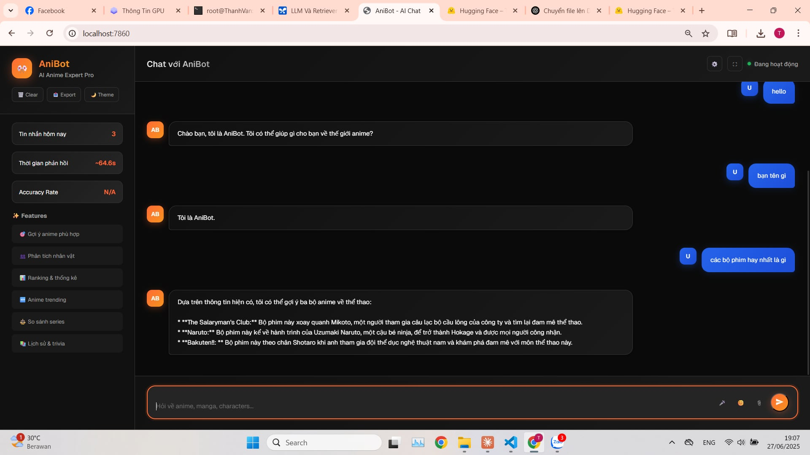
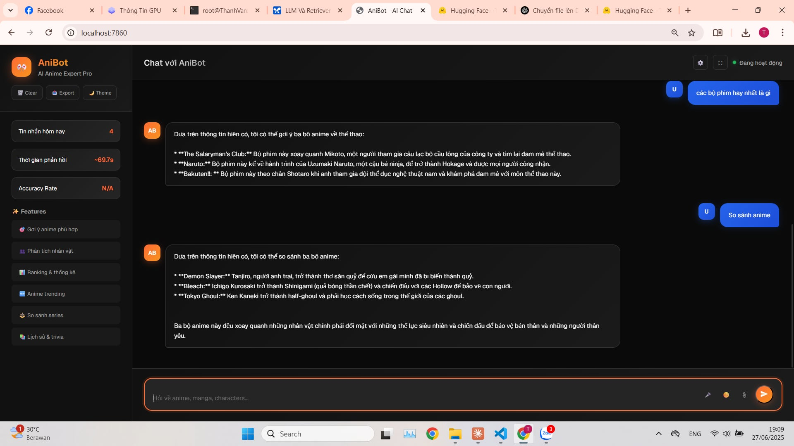

<div align="center">

# AniBot

### Trợ lý AI tiếng Việt dành cho Anime và Manga

AniBot kết hợp **RAG, FAISS và Gemma 2** để tra cứu thông tin, gợi ý Anime và hỗ trợ thứ tự xem bằng hội thoại tự nhiên.

[Demo](#demo) · [Tính năng](#tính-năng) · [Kiến trúc](#kiến-trúc) · [Cài đặt](#cài-đặt) · [Tải mô hình](#tải-mô-hình) · [Hướng phát triển](#hướng-phát-triển)

<br>


</div>

---

## Demo

<div align="center">




</div>

---

## Giới thiệu

**AniBot** là chatbot chuyên biệt về Anime và Manga, hỗ trợ người dùng:

- Tra cứu thông tin Anime
- Gợi ý nội dung tương tự
- Xem thứ tự phát hành hoặc thứ tự xem
- Hỏi đáp bằng tiếng Việt
- Trò chuyện với ngữ cảnh liên tục
- Tìm kiếm thông tin từ knowledge base trước khi sinh câu trả lời

Thay vì gửi mọi câu hỏi trực tiếp đến mô hình ngôn ngữ, hệ thống sử dụng **query routing** để lựa chọn phương pháp xử lý phù hợp.

---

## Tính năng

- Hỏi đáp Anime và Manga bằng tiếng Việt
- Semantic search với sentence embeddings
- Vector retrieval bằng FAISS
- Retrieval-Augmented Generation với Gemma 2 9B
- Gợi ý Anime có nội dung tương tự
- Tra cứu thứ tự xem của các series
- Xử lý nhanh FAQ và câu hỏi đơn giản bằng rules
- Quản lý context hội thoại
- Lưu lịch sử và phương thức tạo câu trả lời
- Giao diện chatbot bằng Gradio
- Chạy mô hình ngôn ngữ cục bộ

---

## Kiến trúc

```text
Người dùng
   ↓
Giao diện Gradio
   ↓
Query Router
   ├── Greeting / FAQ ───────→ Rule-based Response
   ├── Recommendation ───────→ Structured Data
   ├── Watch Order ──────────→ Structured Data
   └── Knowledge Query
          ↓
     all-MiniLM-L6-v2
          ↓
     FAISS Vector Search
          ↓
     Relevant Context
          ↓
       RAG Prompt
          ↓
     Gemma 2 9B Instruct
          ↓
      Câu trả lời
```

---

## Công nghệ sử dụng

| Thành phần | Công nghệ |
|---|---|
| Ngôn ngữ | Python |
| Large Language Model | Google Gemma 2 9B Instruct |
| Embedding model | sentence-transformers/all-MiniLM-L6-v2 |
| Vector search | FAISS |
| Deep Learning | PyTorch |
| LLM framework | Hugging Face Transformers |
| Xử lý dữ liệu | Pandas, OpenPyXL, NumPy |
| Giao diện | Gradio |
| Knowledge base | Microsoft Excel |
| Cấu hình | YAML, JSON |
| Kiến trúc | Retrieval-Augmented Generation |

---

## Cài đặt

```bash
git clone https://github.com/vanujiash9/MOVIE_CHAT.git
cd MOVIE_CHAT
python -m venv .venv
```

Windows:

```bash
.venv\Scripts\activate
```

Linux hoặc macOS:

```bash
source .venv/bin/activate
```

Cài thư viện:

```bash
python -m pip install --upgrade pip
pip install -r requirements.txt
```

---

## Tải mô hình

### Cách 1: Tải từ Google Drive

[📦 Tải Gemma 2 9B và embedding model từ Google Drive](https://drive.google.com/drive/folders/1L5tVq8qTbOgABFLb4pfX1nJFJ9myRXv8?usp=sharing)

Sau khi tải, đặt thư mục `models` tại thư mục gốc:

```text
MOVIE_CHAT/
├── models/
│   ├── embedding_model/
│   └── llm_model/
├── src/
├── data/
└── ...
```

### Cách 2: Tải bằng script

```bash
python src/scripts/download_models.py
```

Model mặc định:

```text
Embedding: sentence-transformers/all-MiniLM-L6-v2
LLM: google/gemma-2-9b-it
```

---

## Xây dựng FAISS index

Đặt dữ liệu tại:

```text
data/Movie_Web_Chatbot_AI.xlsx
```

Chạy:

```bash
python src/scripts/build_index.py
```

---

## Chạy ứng dụng

```bash
python gradio_app.py
```

Truy cập:

```text
http://localhost:7861
```

---

## Ví dụ câu hỏi

```text
Jujutsu Kaisen nói về điều gì?
```

```text
Gợi ý Anime giống Attack on Titan.
```

```text
Thứ tự xem Fate như thế nào?
```

```text
Tôi thích Anime tâm lý, bí ẩn và có nhiều plot twist. Nên xem gì?
```

---

## Cấu trúc dự án

```text
MOVIE_CHAT/
├── config/
├── data/
├── models/
├── src/
│   ├── core/
│   ├── data_utils/
│   └── scripts/
├── logs/
├── gradio_app.py
├── app.py
├── main.py
├── requirements.txt
├── f79a14a4-c488-4e40-952b-3465dee17467.jpg
├── d88847d7-8821-4898-aaec-cb311c47b0f0.jpg
└── README.md
```

---

## Điểm nổi bật kỹ thuật

- Xây dựng pipeline RAG từ dữ liệu Excel
- Tạo semantic embeddings cho knowledge base
- Tích hợp FAISS vector search
- Thiết kế query routing theo nhiều tầng
- Kết hợp rule-based response với LLM
- Quản lý context hội thoại
- Chạy Gemma 2 cục bộ bằng Hugging Face Transformers
- Xây dựng giao diện chatbot bằng Gradio
- Lưu log và theo dõi phương thức sinh câu trả lời

---

## Hướng phát triển

- [ ] Thêm similarity threshold cho retrieval
- [ ] Hiển thị nguồn dữ liệu trong câu trả lời
- [ ] Hỗ trợ quantization 4-bit hoặc 8-bit
- [ ] Xây dựng REST API bằng FastAPI
- [ ] Lưu hội thoại bằng SQLite hoặc PostgreSQL
- [ ] Bổ sung bộ đánh giá retrieval và hallucination
- [ ] Docker hóa ứng dụng
- [ ] Triển khai lên cloud
- [ ] Tích hợp Telegram hoặc Discord

---

## Tác giả

GitHub: [@vanujiash9](https://github.com/vanujiash9)

---

<div align="center">

Được xây dựng bằng **Python, PyTorch, Gemma 2, FAISS và Gradio**.

Nếu dự án hữu ích, hãy để lại một ⭐ để ủng hộ.

</div>
